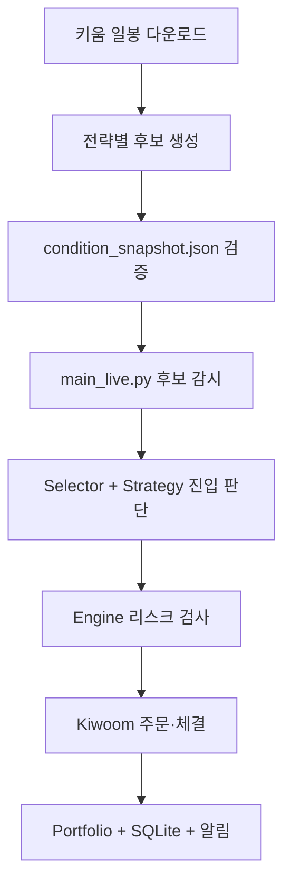

# CherryPulse-KR-01 소스 분석

- 분석 기준일: 2026-09-08
- 분석 기준 브랜치: `main`
- 분석 기준 커밋: `628029c6288d6770feaf61e1eaf8e60b30172409`
- 분석 방식: GitHub 저장소 정적 분석
- 분석 범위: 실행·설정, 후보선정, 전략, 리스크, 주문·체결, 저장소, 백테스트, 운영 문서

> 이 문서는 실제 키움 접속, 주문 실행, 로컬 SQLite 성과 데이터 분석 없이 소스만 검토한 결과다. 따라서 실제 수익성은 판단하지 않으며, 구조·안전성·전략 재현성 관점의 진단만 제공한다.

## 1. 결론

CherryPulse-KR-01은 키움 OpenAPI 기반 한국 주식 자동매매 프로젝트다. 현재 기본 방향은 일봉 후보를 먼저 만들고 다음 거래일에 해당 종목만 감시하는 스윙 매매이며, 활성 전략은 `bottom_reversal`, `leader_pullback`, `close_buy` 세 가지다.

후보·전략·주문·체결·SQLite 기록을 전략명으로 연결하고, 오래된 snapshot 차단, 주문 중복 방지, 일일 손실 제한, 미체결 취소·재매도, 텔레그램 알림을 갖춘 점은 좋다. 다만 실전형 자동매매에 투입하기 전 아래 항목을 우선 해결해야 한다.

1. 저장소에 `.env`가 추적되고 있어 계좌·텔레그램 비밀값 노출 가능성이 있다.
2. `RUN_MODE=live`이면 실제 `SendOrder` 경로가 열리며, 계좌번호가 없으면 로그인 계좌 중 첫 계좌가 자동 선택된다.
3. `daily_candidate_mode=True`에서 리더 눌림목·종가매수 전략의 핵심 장중 조건이 우회된다.
4. 기본 일봉 수집 대상이 20개 종목에 한정되고 대부분 반도체여서 종목·업종 편향이 크다.
5. 로그인 `QEventLoop`에 timeout이 없어 로그인 이벤트가 누락되면 무기한 멈출 수 있다.
6. 운영 전략과 동일한 규칙·비용·체결 가정으로 검증하는 자동화 테스트와 백테스트가 부족하다.

현재 상태는 “안전장치가 상당 부분 들어간 모의검증용 시스템”에 가깝다. 실계좌 승격보다 먼저 비밀값 제거, 실주문 이중 잠금, 전략 정의 정합성, 검증 체계 보강이 필요하다.

## 2. 시스템 구조

주요 책임은 다음과 같다.

| 영역 | 주요 파일 | 현재 역할 |
|---|---|---|
| 실행·운영 | `main_live.py` | 앱 시작, 계좌 동기화, snapshot 로딩, 실시간 등록, 재접속, 종료 |
| 설정 | `config_live.py` | 실행 모드, 전략 활성화, 주문금액, 손절·익절, 시간, timeout |
| 후보선정 | `download_daily_candles.py`, `build_daily_strategy_snapshot.py` | 일봉 수집과 다음 거래일 후보 생성 |
| 유니버스 | `universe_manager.py`, `selectors/*` | 전략별 snapshot/조건검색 후보 분리와 장중 1차 필터 |
| 진입전략 | `strategies/*` | 매수 신호 생성 |
| 주문·청산 | `engine.py` | 리스크 검사, 주문 제출, 체결 반영, 전략별 청산 |
| 증권사 연결 | `broker/kiwoom_broker.py` | 키움 로그인, TR, 실시간, 주문·취소, 체결 이벤트 |
| 상태·기록 | `core/*`, `infra/sqlite_store.py` | 포트폴리오·주문 상태와 거래 데이터 저장 |
| 분석 | `analyze_strategy_performance.py`, `compare_four_strategies.py` | SQLite 및 로그 기반 전략 비교 |
| 백테스트 | `backtest/*`, `quant_bottom_reversal_backtest.py` | 범용 단순 백테스트와 바닥반전 일봉 백테스트 |

## 3. 현재 활성 전략과 리스크 설정

`config_live.py` 기준 기본 활성 상태다.

| 전략 | 활성 | 진입 시간 | 1회 주문금액 | 일일 매수 한도 | 전략 최대 보유 | 주요 청산값 |
|---|---:|---|---:|---:|---:|---|
| `bottom_reversal` | 예 | 09:35~14:20 | 300,000원 | 2회 | 1종목 | 손절 -5%, 부분익절 +10%, 목표 +20%, 최대 20일 |
| `leader_pullback` | 예 | 09:40~14:30 | 300,000원 | 3회 | 1종목 | 손절 -1.7%, 부분익절 +2.2%, 목표 +3.6% |
| `close_buy` | 예 | 15:15~15:25 | 300,000원 | 1회 | 1종목 | 손절 -2%, 부분익절 +2.5%, 목표 +4.5%, 익일 09:05~09:30 청산 |
| `momentum` | 아니오 | 09:35~14:50 | 1,000,000원 | 4회 | 2종목 | 손절 -1.2%, 목표 +2.8% |
| `vcp_box` | 아니오 | 09:45~14:20 | 300,000원 | 1회 | 1종목 | 손절 -1.2%, 목표 +4% |

공통 설정에는 최대 보유 3종목, 일일 실현손실 -150,000원, 신규매수 당일 상승률 10% 이상 차단, 손절 후 당일 재매수 차단이 있다. 전략별 후보와 주문·체결·성과 경로를 별도 기록하는 구조도 구현되어 있다.

## 4. 잘된 점

### 4.1 오래된 후보 차단

`main_live.py:452-526`에서 snapshot을 읽고 최신성 검증 실패 시 전략 유니버스를 비운다. 오래된 일봉으로 신규매수가 발생하는 것을 막는 fail-closed 방식이다.

### 4.2 전략별 유니버스와 성과 분리

`universe_manager.py`가 snapshot과 조건검색 소스를 전략별로 분배하고, `engine.py`와 `infra/sqlite_store.py`가 `strategy_name`, `selector_name`, `universe_name`을 주문·체결·거래에 기록한다. 전략별 성과 비교의 기반이 마련되어 있다.

### 4.3 주문·체결 방어

`engine.py:2859-2981`에서 엔진 상태, 장 시간, 일일 손실, 주문 횟수, 전략 활성화, 재진입, 중복·보유 한도, 주문금액, 예수금을 검사한다. `engine.py:3145-3258`에서는 누적 체결량을 정규화하여 중복 체결 반영을 줄인다.

### 4.4 TR·조건검색 timeout과 재시도

`broker/kiwoom_broker.py:103-128`에 TR/조건검색용 timeout 래퍼가 있고, 조회 제한·주문 제한 오류에 제한된 재시도를 적용한다. 재접속에도 횟수·시간대 제한과 알림 throttling이 있다.

### 4.5 운영 관측성

SQLite에 신호, 주문, 체결, 거래, 전략별 일일 요약, 유니버스 snapshot을 기록하고 텔레그램 알림과 분석 스크립트를 제공한다. “후보 없음”, “전략 탈락”, “주문 차단”, “체결 실패”를 분리해 진단할 수 있는 방향이다.

## 5. 주요 발견사항

### P0 — 즉시 조치

#### 5.1 저장소에 `.env`가 추적됨

- 근거: 현재 Git 트리에 `.env` 파일이 존재한다. `.gitignore`에는 이미 `.env` 제외 규칙이 있지만, 기존 추적 파일에는 적용되지 않는다.
- 추가 위험: `_backups/CherryPulse-KR-01_2026-04-12_194717.zip`도 추적 중이며 내부에 비밀값이 포함됐는지는 별도 확인이 필요하다.
- 영향: 저장소 접근권한을 가진 사용자, 백업, 포크, 로그를 통해 계좌번호·비밀번호·텔레그램 토큰이 노출될 수 있다.
- 권고:
  1. 현재 비밀값을 모두 교체한다.
  2. `git rm --cached .env`로 추적을 중단한다.
  3. 백업 ZIP 내부를 안전한 로컬 환경에서 점검하고 비밀값이 있으면 제거한다.
  4. 유효한 비밀값이 과거 커밋에 있었다면 Git 기록 정리까지 수행한다.

#### 5.2 실주문 모드와 계좌 선택에 이중 잠금이 없음

- 근거: `config_live.py:16-21`에서 `RUN_MODE=live`만으로 `ALLOW_LIVE_ORDERS=True`가 된다.
- 근거: `broker/kiwoom_broker.py:286-311`에서 `ACCOUNT_NO`가 없으면 로그인 계좌 목록의 첫 계좌를 선택한다.
- 근거: `broker/kiwoom_broker.py:951-1009`에서 live이면 키움 `SendOrder`를 호출한다.
- 영향: 계좌 순서나 환경 설정 실수로 의도하지 않은 계좌에 실제 주문이 전송될 수 있다.
- 권고:
  - live에서는 `ACCOUNT_NO`를 필수로 하고 자동 첫 계좌 선택을 금지한다.
  - 키움 모의투자/실서버 구분값을 조회해 기대 환경과 다르면 시작을 차단한다.
  - `RUN_MODE=live` 외에 별도의 일회성 확인값과 계좌 allowlist를 요구한다.
  - 시작 로그와 텔레그램에 마스킹된 계좌, 서버 구분, 주문 허용 상태를 표시한다.

### P1 — 전략·운영 신뢰성

#### 5.3 활성 전략의 이름과 실제 진입 규칙이 다름

- 근거: `config_live.py:382`에서 `daily_candidate_mode=True`다.
- `leader_pullback_strategy.py:118-137`은 이 모드에서 장중 눌림, 지지, 반등 확인을 건너뛰고 등락률 범위만 통과하면 매수 신호를 낸다.
- `close_buy_strategy.py:129-147`도 RSI2, 저점 회복, 고점 대비 눌림, 거래량·점수 검사를 건너뛴다.
- selector와 시간 필터는 남아 있지만 전략의 핵심 가설과 실제 신호가 일치하지 않는다.
- 영향: 전략별 성과를 “리더 눌림목” 또는 “RSI2 종가매수” 성과로 해석하면 잘못된 결론을 낼 수 있다.
- 권고:
  - `daily_candidate_mode`를 전략별 설정으로 분리한다.
  - 우회 모드는 `daily_candidate_direct_entry`처럼 별도 전략명·버전으로 기록한다.
  - 원래 전략을 쓸 경우 핵심 장중 조건을 다시 적용하고 백테스트·모의투자를 새 버전으로 시작한다.

#### 5.4 기본 종목군이 20개, 대부분 반도체에 집중됨

- 근거: `download_daily_candles.py:20-41`의 `DEFAULT_SYMBOLS`가 고정 20종목이며, 기본 CLI 입력도 이 목록을 그대로 사용한다.
- 영향: snapshot 후보는 원천 데이터에 없는 종목을 선택할 수 없다. 특정 업종 장세가 나쁘면 모든 전략이 동시에 부진해질 수 있고, 성과가 전략 효과인지 반도체 업종 효과인지 분리하기 어렵다.
- 권고:
  - KOSPI/KOSDAQ에서 거래대금, 가격, 관리·정지·신규상장 제외 기준으로 매일 유니버스를 생성한다.
  - 업종별 후보·보유 한도를 둔다.
  - 생존편향을 줄이기 위해 날짜별 당시 유니버스를 보관한다.
  - 전략 성과와 업종·시장 국면 성과를 함께 비교한다.

#### 5.5 로그인 대기에 timeout이 없음

- 근거: TR과 조건검색은 timeout 래퍼를 사용하지만 `broker/kiwoom_broker.py:286-295`의 로그인은 `self.login_loop.exec_()`를 직접 호출한다.
- 영향: 로그인 이벤트가 오지 않으면 시작·재접속·자동종료가 무기한 멈출 수 있다.
- 권고: 로그인에도 전용 timeout, 최대 재시도, backoff, 실패 알림, 안전 종료를 적용한다.

#### 5.6 snapshot 생성일 검증이 운영 설명과 충돌함

- 근거: `main_live.py:542`와 `validate_daily_snapshot.py`는 `generated_at` 날짜가 실행 당일과 다르면 즉시 실패한다.
- 문서상 후보는 장마감 후 또는 다음날 장 시작 전에 만들 수 있고, 로그 표현도 “전일 snapshot”을 사용한다.
- 영향: 전날 장마감 후 정상 생성한 snapshot도 다음날 실행 시 거부될 수 있다.
- 권고: 생성일 자체보다 `latest_data_date`가 직전 거래일인지 검증하고, 허용 생성 구간을 명시한다.

#### 5.7 휴장일이 수동 하드코딩됨

- 근거: `config_live.py:99-103`의 `MARKET_HOLIDAYS` 목록을 `main_live.py`와 snapshot 검증이 공통 사용한다.
- 영향: 누락된 임시공휴일·거래소 휴장일에 장이 열린 것으로 판단하거나 정상 snapshot을 오래된 데이터로 판단할 수 있다.
- 권고: 연도별 거래소 캘린더를 자동 갱신하고, 실패 시 신규매수 차단으로 동작하게 한다.

### P2 — 검증·유지보수

#### 5.8 리스크 모듈과 실제 리스크 경로가 분리되어 있음

- 근거: `engine.py:27`에서 `RiskManager`를 만들지만 이후 실제 주문 검사는 `engine.py:2859`의 `can_send_order()`가 담당한다.
- `engine.py`는 약 3,300줄이며 진입, 청산, 리스크, 체결, DB, 알림을 함께 처리한다.
- `core/portfolio.py`와 `core/position_manager.py`에는 서로 다른 Position 모델도 존재한다.
- 영향: 안전규칙 변경 시 한 경로만 수정하거나 테스트하는 구조가 되기 쉽다.
- 권고: 주문 전 검사를 하나의 RiskManager 경로로 통합하고, 엔진을 진입 조정·청산 정책·체결 처리·저장으로 단계적으로 분리한다.

#### 5.9 백테스트가 운영 전략을 그대로 재현하지 않음

- 범용 `backtest/runner.py`는 수수료·세금·슬리피지를 반영하지 않고 마지막 틱에 강제청산한다.
- `backtest/csv_feed.py:14`는 체결강도를 기본 150으로 가정한다.
- 바닥반전 전용 백테스트는 다음날 시가 진입과 고정 손절·익절을 사용하지만, 실제 엔진의 부분익절·트레일링·장중 필터·체결 지연을 동일하게 재현하지 않는다.
- 영향: 백테스트 기대값과 실전형 모의투자 결과 사이 차이가 커질 수 있다.
- 권고:
  - 운영 전략 코드를 재사용하는 이벤트 기반 백테스트 어댑터를 만든다.
  - 수수료, 매도세, 슬리피지, 호가단위, 거래정지, 상·하한가, 부분체결을 반영한다.
  - 학습/검증 기간 분리와 워크포워드 검증을 적용한다.
  - 전략 버전별 최소 거래수, profit factor, MDD, 연속손실, 종목 집중도를 저장한다.

#### 5.10 자동화 테스트와 CI가 사실상 없음

- 현재 저장소에는 일반적인 `tests/` 테스트 스위트와 GitHub Actions workflow가 없다.
- `run_verify_harness.bat`는 문법 검사, snapshot 생성, 바닥반전 백테스트만 수행한다.
- 영향: 주문 중복, 부분체결, 재접속, 일일 손실 차단, snapshot 경계일 같은 고위험 회귀를 자동 검출하기 어렵다.
- 권고 우선 테스트:
  1. live 모드 계좌·서버 검증 실패 시 주문 차단
  2. 동일 체결 이벤트 중복 수신 시 포지션 불변
  3. 부분체결·취소·재매도 상태 전이
  4. snapshot 주말·휴장일·전일 생성 경계
  5. 전략별 유니버스 격리
  6. 일일 손실·연속손실 보호
  7. 로그인/TR timeout
  8. paper 모드에서 `SendOrder` 미호출

#### 5.11 저장소 위생과 재현성 부족

- 21개의 `.pyc`와 여러 `__pycache__` 파일, 프로젝트 ZIP 백업, 일봉 데이터가 Git에 포함되어 있다.
- `requirements.txt`는 `PyQt5`, `python-dotenv` 버전을 고정하지 않는다.
- 최상위 안내가 표준 `README.md`가 아닌 `readme.txt`다.
- 영향: diff 노이즈, 저장소 비대화, 환경별 동작 차이, 신규 작업자의 설치 실패 가능성이 커진다.
- 권고: 생성물을 추적 해제하고, Python/Windows/키움 OpenAPI 환경과 의존성 버전을 명시한 `README.md` 및 잠금 파일을 추가한다.

## 6. 권장 개선 순서

### 1단계 — 주문·비밀값 안전

- 비밀값 교체 및 `.env`·백업 추적 제거
- live 계좌번호 필수화
- 모의/실서버 검증과 일회성 live 확인값 추가
- 로그인 timeout 추가

### 2단계 — 전략 정의 고정

- 현재 신호를 실제 동작 기준으로 새 전략명·버전으로 기록
- `daily_candidate_mode`를 전략별로 분리
- 진입·청산·보유기간·무효화 조건을 전략 문서로 고정
- 최소 30회 전에는 잠정 결과, 목표 200회 백테스트·50회 모의거래 기준 적용

### 3단계 — 종목선정 개선

- 20개 반도체 고정 목록을 거래대금 기반 시장 유니버스로 교체
- 업종 집중 한도 및 시장 국면 필터 도입
- 후보가 없을 때 필터를 동시에 완화하지 않고 탈락 사유 분포부터 확인

### 4단계 — 검증 일치

- 운영 전략과 같은 코드를 쓰는 백테스트 구축
- 비용·세금·슬리피지·체결 제약 반영
- pytest 회귀 테스트와 CI 추가
- 전략 버전 이후 기간만 별도로 성과 비교

### 5단계 — 구조 정리

- `engine.py`의 리스크·청산·체결·저장을 분리
- 사용하지 않는 상태 모델과 레거시 모듈 정리
- 문서와 실제 설정을 자동 검사하는 configuration test 추가

## 7. 수익성 판단에 필요한 추가 데이터

소스만으로 수익 여부를 판단할 수 없다. 다음 데이터를 로컬 SQLite에서 전략 버전별로 추출해야 한다.

| 지표 | 목적 |
|---|---|
| 거래수·승률 | 표본 크기와 적중률 확인 |
| 평균이익·평균손실 | 손익비 확인 |
| 기대값·profit factor | 비용 차감 후 전략 우위 확인 |
| 최대낙폭·최대 연속손실 | 계좌 생존 가능성 확인 |
| 종목·업종별 손익 기여도 | 특정 종목/반도체 의존도 확인 |
| 후보→신호→주문→체결 전환율 | 손실 원인이 선정·진입·주문 중 어디인지 구분 |
| 보유기간·청산사유별 손익 | 손절, 부분익절, 트레일링 규칙 평가 |
| 변경일 전후 성과 | 서로 다른 전략 버전 혼합 방지 |

## 8. 최종 평가

- 구조 방향: 양호 — snapshot 기반 후보, 전략별 유니버스, 주문·체결 기록 구조가 있다.
- 주문 안전: 보완 필요 — live 모드와 계좌 선택에 강한 이중 잠금이 필요하다.
- 종목선정: 취약 — 기본 유니버스가 좁고 업종 편향이 크다.
- 전략 재현성: 취약 — 일부 활성 전략은 이름과 실제 진입 조건이 다르다.
- 검증 수준: 부족 — 운영 코드와 일치하는 백테스트·회귀 테스트·CI가 필요하다.
- 실계좌 준비도: 낮음 — P0와 P1 항목을 해결하고 충분한 모의 표본을 확보하기 전에는 승격하지 않는 것이 안전하다.
