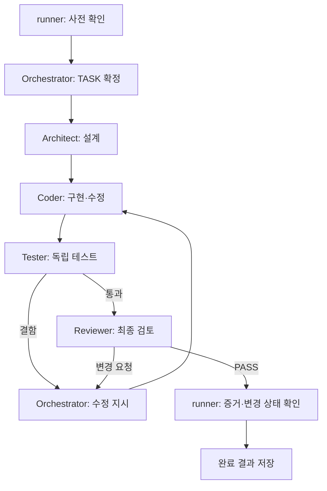

# CherryPulse-KR-01 — Herdr · OpenCode 5역할 개발 자동화 계획서

- 작성일: 2026-09-11 / 버전: 1.0
- 상위 기준: `CherryPulse-KR-01-Development-Direction.md`
- 목표: Herdr에서 OpenCode를 운영하며 지시·설계·구현·테스트·리뷰를 자동 연결한다. 추가 모델 사용료 0원을 우선하고 품질은 실행 증거로 확인한다.
- 문서 범위: 자동화 설계와 도입 계획. 현재 PC 설정, Zen 결제 내역, 설치 버전, 저장소 파일은 이번 작성에서 직접 확인하지 않았다. 설정 적용·코드 수정·배포는 아직 수행하지 않았다.

## 1. 권장 구성

**Herdr는 실행 화면과 세션을 관리하고, PowerShell runner가 단계·재시도·완료 조건을 통제하며, OpenCode의 5개 역할이 각 단계의 지적 작업을 수행한다.**

Herdr는 OpenCode를 포함한 기존 CLI의 터미널을 관리하며, CLI·소켓을 통한 에이전트 연동을 지원한다. 사용자 PC의 실제 버전에서 지원하는 방식은 착수 시 확인한다. [Herdr 공식 저장소](https://github.com/herdrdev/herdr).

| 구성 | 역할 | 이번 계획의 운영 방식 |
|---|---|---|
| Herdr | 실행 화면·세션·상태 확인 | runner 실행 창, 역할별 로그, 테스트 결과를 확인 |
| PowerShell runner | 정해진 순서·권한·증거 검사 | 기존 `scripts/run-task.ps1`를 확인하고 확장 |
| OpenCode | 5개 역할의 모델 실행 | 역할별 독립 세션, 명시적 모델·입력·출력 계약 |
| Zen | 모델 공급 | 무료 모델만 허용하는 기본 프로필 |
| Git 작업 공간 | 변경 격리·리뷰 기준 | TASK별 작업 공간과 기준 상태 기록 |

Orchestrator는 다음 작업과 수정 방향을 판단한다. runner는 그 판단을 검증하고 실행한다. Orchestrator가 임의로 Reviewer를 생략하거나 자신의 결과를 PASS로 처리할 수 없게 한다.

5개 역할을 유지하되, 같은 파일을 동시에 수정하는 5개 프로세스로 운영하지 않는다. 초기에는 하나의 TASK를 순차 처리하고, 충돌 없는 작업 분리가 확인된 뒤 병렬화를 검토한다.

## 2. 비용 전제와 확인된 무료 모델

Zen 공식 문서는 사용량 과금을 안내하며 Big Pickle과 MiMo-V2.5 Free를 무료로 표시한다. 무료 제공은 한시적이다. 따라서 Zen 계정 보유가 모든 모델의 무료 사용을 의미하지 않는다. [Zen 요금·모델 안내](https://opencode.ai/docs/zen/).

OpenCode Go는 별도 구독 상품이다. 사용자가 말한 ‘Zen 구독’이 Go인지, Zen 잔액 충전인지 계정에서 확인한다. 이미 Go가 있다면 구독 한도 내 사용은 별도 프로필로 검토하되, 이 문서의 기본은 무료 모델만 사용하는 구성이다. [Go 공식 안내](https://opencode.ai/docs/go/).

| 역할 | 초기 모델 배정안 | 실행 목적 | 전체 모델 토큰 배분 목표 |
|---|---|---|---|
| Orchestrator / 지시자 | `opencode/big-pickle` | 작업 분해·단계 결과 정리 | 3% |
| Architect / 설계 | `opencode/mimo-v2.5-free` | 구조·인터페이스·완료 조건 정의 | 5% |
| Coder / 구현 | `opencode/big-pickle` | 실제 구현과 결함 수정 | 80% |
| Tester / 테스트 | `opencode/mimo-v2.5-free` | 독립 시나리오·테스트 작성·결과 해석 | 5% |
| Reviewer / 리뷰 | `opencode/mimo-v2.5-free` | 다른 세션에서 코드·증거 최종 검토 | 7% |

위 모델 ID의 근거는 [Zen 모델 목록](https://opencode.ai/docs/zen/)이다. 역할 배정과 비율은 본 프로젝트의 시작안이며, 모델 간 성능 우위를 입증한 결과가 아니다. 작은 실제 개발 과제로 비교한 뒤 조정한다. Coder와 Reviewer를 다른 모델로 두지만 서로 다른 모델이라는 이유만으로 독립성과 품질이 보장되지는 않는다.

80%는 평균적인 구현 비중 목표다. 손절·주문·동시성 변경에서는 설계·테스트·리뷰 예산을 늘린다. 토큰 비율을 맞추기 위해 필요한 검토를 생략하지 않는다. 무료 한도와 응답 속도 때문에 완전 무중단 개발은 보장할 수 없다.

### 추가 과금 방지

1. 각 역할의 모델을 명시하고 무료 모델 allowlist 밖의 모델 요청을 막는 실행 경로를 구성한다.
2. 기본 모델뿐 아니라 제목 생성용 `small_model`, 요약·압축·내장 하위 에이전트의 실제 모델도 확인한다. `small_model`은 가벼운 작업에 별도 모델을 사용하는 공식 설정이다. [OpenCode 설정](https://opencode.ai/docs/config/).
3. 자동 충전을 끄고 사용량 제한을 확인한다. 자동 충전 해제만으로 유료 잔액 소진까지 막을 수는 없으므로 모델 제한과 함께 적용한다. [Zen 결제 설정](https://opencode.ai/docs/zen/).
4. 무료 모델이 실패하면 현재 무료임이 확인된 대체 모델로만 재시도한다. 없으면 `WAITING_MODEL`로 보존하고 유료 모델로 자동 전환하지 않는다.
5. 단계별 provider/model·토큰·보고 비용을 저장하고 계정 사용 내역과 대조한다. 단가 정보가 없거나 서로 다르면 무료로 추정하지 않는다.

무료 모델은 별도 데이터 처리 조건이 있다. Big Pickle과 MiMo의 무료 기간 데이터가 모델 개선에 사용될 수 있다는 공식 안내를 적용한다. 계좌 정보·인증키·실운영 DB·비밀 로그를 모델 입력에서 제외하고 필요한 코드는 허용된 범위에서만 제공한다. [Zen 데이터 처리 안내](https://opencode.ai/docs/zen/#privacy).

여기서 무료 목표는 추가 AI 모델 호출 비용이다. 기존 구독료, PC 운영비, Vercel·DB 등 제품 운영비와는 별개다.

## 3. 역할별 책임과 권한

| 역할 | 입력 | 책임 | 산출물 | 수정 범위 |
|---|---|---|---|---|
| Orchestrator | 개발방향·목표·현재 상태 | 작은 TASK로 분해, 범위·우선순위·재작업 지시 | TASK 명세, 수정 지시 | 작업 명세·진행 기록 |
| Architect | TASK·관련 코드 | 데이터·인터페이스·상태 전이·제거 영향 설계 | 설계서·수용 기준 | 설계 문서 |
| Coder | TASK·설계·실패 증거 | 허용된 구현·수정, 자체 점검 | 코드·구현 보고 | TASK 구현 범위 |
| Tester | 명세·최종 구현 상태 | 독립 테스트·경계 조건·재현 절차 작성 | 테스트 코드·결과 | 테스트 파일. 제품 코드는 직접 수정하지 않음 |
| Reviewer | 명세·설계·실제 변경·테스트 증거 | 누락·결함·회귀·범위 검토 | PASS / CHANGES_REQUESTED / BLOCKED와 근거 | 제품·테스트 코드 읽기 전용 |

보고서는 가능하면 역할의 구조화된 출력을 runner가 지정 위치에 저장한다. 따라서 Reviewer에게 코드 쓰기 권한을 주지 않아도 리뷰 문서를 남길 수 있다.

권한은 프롬프트만으로 통제하지 않는다. OpenCode의 역할 권한, runner의 허용 경로 검사, 작업 공간 분리와 실행 명령 제한을 함께 사용한다. OpenCode는 프로젝트별 `.opencode/agents/`와 역할별 모델·권한 설정을 지원한다. [에이전트 설정](https://opencode.ai/docs/agents/).

리뷰·테스트 대상 프로그램이 임의 명령을 실행할 수 있다는 점도 고려한다. 배포·증권사 비밀값이 없는 테스트 환경에서 실행하며, 테스트 스크립트나 셸을 통해 역할의 수정 제한을 우회하지 못하도록 실제 변경 내역을 검사한다.

## 4. 자동 처리 흐름



설계 결함이면 Architect로 되돌아가 해당 설계만 수정한다. 권한·환경·증거 누락이면 BLOCKED, 모델 가용성 문제면 WAITING_MODEL로 남긴다. 실패할 때마다 요구사항 전체를 처음부터 다시 생성하지 않는다.

### 단계 실행 원칙

- Orchestrator가 만든 TASK를 runner가 읽어 필수 항목·범위·예산을 확인한 뒤 진행한다.
- Coder가 쓰는 동안 Tester·Reviewer는 같은 작업본을 검토하지 않는다. 구현 상태를 확정하고 테스트·리뷰를 실행한다.
- 역할마다 새 세션을 시작하고 TASK·설계·관련 파일·직전 실패만 전달한다. Reviewer에게 Coder의 긴 대화 전체를 전달하지 않는다.
- Tester는 명세에서 기대 동작을 도출하고 코드를 그대로 복제한 테스트나 통과를 위한 assertion 삭제를 피한다.
- 테스트 실패는 명령·종료 코드·실제 출력으로 기록한다. Coder의 ‘테스트 통과’ 서술만으로 다음 단계로 넘어가지 않는다.
- 역할 프로세스가 정상 종료했더라도 요구 산출물이나 필수 테스트가 없으면 PASS로 처리하지 않는다.

## 5. 무료 모델에서도 품질을 확보하는 방법

| 방법 | 적용 방식 |
|---|---|
| 작은 TASK | 하나의 사용자 동작 또는 상태 전이를 한 작업으로 제한 |
| 명시적 완료 조건 | 입력·기대 출력·실패 처리·수정 범위를 코딩 전에 확정 |
| 독립 테스트 | Tester가 명세 기준으로 경계·회귀 사례 작성 |
| 증거 기반 리뷰 | 구현 상태와 테스트 결과가 같은 버전인지 확인 |
| 짧은 피드백 | 결함 위치·재현·기대 동작만 Coder에게 전달 |
| 기본 자동 검사 | 실제 프로젝트 명령으로 빌드·타입·정적 검사·테스트 실행 |
| 핵심 장애 시나리오 | 중복 이벤트·부분체결·재시작·미체결을 모의 환경에서 재현 |

도입 초기에 두 무료 모델을 같은 소규모 개발 과제로 비교한다. UI 수정, 패턴 입력 처리, 중복 이벤트 방지 등 3개 과제를 사용하고 기능 정확성·수정 횟수·리뷰 결함·시간·토큰을 기록한다. 중요 결함을 놓친 모델은 해당 역할에 고정하지 않는다. 무료 모델로 품질 기준을 충족하지 못하면 완료로 꾸미지 않고 작업을 더 작게 나누거나 확인 필요 상태로 남긴다.

이 평가 대상은 개발 도구의 수행 품질이다. 사용자께서 제거하기로 한 매매 전략 성과 검증은 제품에 추가하지 않는다.

## 6. 재시도·예산·재개 정책

초기값은 운영 경험에 따라 조정한다.

| 항목 | 초기 정책 |
|---|---|
| 동시 작업 | 하나의 TASK, 하나의 코드 작성자 |
| 자동 수정 | 최초 구현 후 최대 2회 수정 사이클 |
| 같은 실패 반복 | 동일 오류가 2회 이어지면 원인·증거를 정리하고 자동 반복 중단 |
| API 일시 오류 | Retry-After 우선, 없으면 15초·30초·60초 간격의 제한된 재시도 |
| 역할 실행시간 | 기본 20분 상한안. 정상 장기 테스트는 TASK에서 별도 명시 |
| 모델 사용량 | TASK별 토큰 상한을 도입 실험 후 결정. 80% 도달 시 요약·분할, 상한 초과 시 상태 저장 |
| 재개 | 마지막 성공 단계와 파일 상태가 일치하면 다음 단계부터 진행 |

프로세스 종료 전후 파일 상태를 확인해 반쯤 적용된 수정을 그대로 재실행하지 않는다. 작업 큐·진행 상태는 runner가 저장하며 모델이 스스로 무제한 재귀 호출하지 못하게 한다.

Herdr의 클라이언트 종료와 PC 종료는 다르다. 공식 안내상 백그라운드 서버가 유지되면 터미널 작업이 계속될 수 있지만, PC·서버 재시작 후 기존 프로세스가 그대로 살아 있는 것은 아니다. 따라서 재개 근거는 runner 체크포인트로 관리한다. [Herdr 세션 동작](https://github.com/herdrdev/herdr).

## 7. 기존 TASK-010 문제의 재발 방지

기존 대화에서는 reviewPaths가 baseline JSON만 포함해 실제 구현·테스트를 리뷰할 수 없었던 BLOCKED 사례가 있었다. 최신 상태는 착수 시 확인한다.

1. 작업 시작 시 기준 커밋과 기존 staged·unstaged·untracked 변경을 각각 기록한다. 기존 미커밋 작업을 reset·clean으로 제거하지 않는다.
2. TASK에 허용 수정 경로와 완료 조건을 정하고 runner가 기준 manifest를 관리한다. 역할 모델이 리뷰 제외를 목적으로 manifest를 임의 축소하지 못하게 한다.
3. 최종 diff는 기준 커밋 이후 커밋 변경뿐 아니라 staged·unstaged·신규·삭제·이름 변경 파일까지 포함한다. 미커밋 기준이 있으면 보존된 시작 상태와도 비교한다.
4. `reviewPaths`에는 실제 변경 파일 전체를 포함한다. 읽기 참조 범위에는 관련 호출부·인터페이스도 포함하여 파일 하나만 보고 판단하지 않게 한다.
5. 범위 밖 변경은 자동 제외하지 않고 Orchestrator가 원인과 필요성을 정리한다. 이미 승인된 목표 안의 범위 보정은 기록하고 다시 검사한다.
6. Tester와 Reviewer가 본 소스·테스트·잠금파일의 내용 해시가 일치해야 최종 PASS를 인정한다. 리뷰 이후 코드가 바뀌면 관련 테스트와 리뷰를 다시 수행한다.

문서 출력 자체로 끝없는 해시 변경이 생기지 않도록 실행 증거 디렉터리는 제품 상태 해시에서 구분한다. 다만 해당 문서·manifest의 변경 내역도 감사 기록에는 남긴다.

## 8. 예상 파일 구성

아래는 생성·수정 예정 항목이며 현재 존재를 확인한 목록은 아니다. 번호와 경로는 기존 저장소 규칙에 맞춘다.

| 경로안 | 역할 |
|---|---|
| `opencode.json` | 기본·보조 모델, 역할 연결, 권한 설정 |
| `.opencode/agents/orchestrator.md` | 지시자 역할 |
| `.opencode/agents/architect.md` | 설계 역할 |
| `.opencode/agents/coder.md` | 구현 역할 |
| `.opencode/agents/tester.md` | 테스트 역할 |
| `.opencode/agents/reviewer.md` | 최종 리뷰 역할 |
| `scripts/run-task.ps1` | 기존 runner 확장 대상 |
| `automation/model-policy.json` | 무료 모델 allowlist·확인 시각·대체 순서 |
| `automation/pipeline-policy.json` | 단계·권한·재시도·예산 계약 |
| `docs/agent-handoff/TASK-###.md` | 작업 목표·수용 기준·범위 |
| `docs/agent-handoff/TASK-###-DESIGN.md` | 설계 |
| `docs/agent-handoff/TASK-###-RESULT.md` | 구현 내용 |
| `docs/agent-handoff/TASK-###-TEST.md` | 실행 명령·결과 |
| `docs/agent-handoff/TASK-###-REVIEW.md` | 판정·결함·근거 |
| `docs/agent-handoff/TASK-###-MANIFEST.json` | 기준·변경 경로·해시 |

작업별 runId를 부여하고 역할·모델·세션 ID·시작/종료 시각·재시도 횟수·토큰·비용·테스트 종료 코드·리뷰 판정을 저장한다. 원본 대화·로그는 비밀값을 제거한 별도 실행 디렉터리에 두고 Git에는 필요한 근거만 반영한다.

## 9. OpenCode 연결 방식

기존 PowerShell runner와의 연결을 단순하게 유지하기 위해 각 역할을 `opencode run`으로 독립 호출하는 방식을 기본으로 한다. 이 경로의 역할은 직접 실행 가능한 mode를 사용한다. 추후 primary/subagent 위임을 사용하더라도 같은 게이트와 기록을 유지한다.

OpenCode CLI는 `run`, `--agent`, `--model`, `--file`, `--format json`을 지원한다. JSON 옵션은 이벤트 스트림이며 리뷰 판정 JSON이 자동으로 생성된다는 뜻은 아니다. runner가 최종 역할 출력을 분리하고 별도 스키마로 검사해야 한다. [OpenCode CLI](https://opencode.ai/docs/cli/).

설치 상태 조사에 사용할 명령은 다음과 같다. 계정 비밀값은 출력·공유하지 않는다.

```powershell
opencode --version
opencode agent list
opencode models opencode --refresh --verbose
```

모델 목록과 로컬 비용 메타데이터만으로 실제 계정 과금이 확정되지는 않는다. 계정별 사용 가능 여부·요금 표시·시험 실행 내역을 함께 확인한다. [모델 조회 옵션](https://opencode.ai/docs/cli/#models).

기존 runner의 매개변수는 실제 파일을 읽고 확인한다. 아직 구현하지 않은 옵션이나 추정한 Herdr 명령을 즉시 실행 가능한 명령으로 제공하지 않는다.

## 10. Herdr에서 보는 개발 상태

사용자는 Herdr에서 runner를 한 번 시작하고 진행 상태를 확인한다. 기본 배치는 runner, 현재 역할 출력, 테스트 로그를 보는 구성으로 충분하다. 역할이 바뀔 때 현재 역할·모델·TASK·시도 횟수를 표시한다. 5개 역할 창을 사용하더라도 대기 중인 역할은 모델을 호출하지 않는다.

표시할 상태는 `QUEUED`, `DESIGNING`, `CODING`, `TESTING`, `REVIEWING`, `FIXING`, `WAITING_MODEL`, `BLOCKED`, `DONE`으로 정한다. Herdr 자체 working/idle 상태와 runner의 TASK 완료 상태를 구분한다.

이 화면은 개발 자동화 진행 화면이다. CherryPulse 웹의 종목 트레이딩 보드는 별도 제품 화면으로 개발한다.

## 11. 자동화 범위와 최종 품질 게이트

자동 진행 범위는 승인된 TASK의 설계·코드 수정·테스트·리뷰·제한된 재작업·결과 문서 저장까지다. 일상적인 파일 읽기·허용 범위 수정·테스트마다 사용자 확인을 요구하지 않도록 정책을 정한다.

다음 조건을 모두 만족하면 `DONE`으로 기록한다.

- 요구 동작과 수용 기준 충족.
- 필수 테스트·빌드 등 실제 프로젝트 검사가 같은 변경 상태에서 성공.
- Reviewer의 PASS와 근거 존재, 미해결 중대 결함 없음.
- 변경 파일 전체 검토 및 권한·범위 위반 없음.
- 무료 모델 정책 준수와 실행 이력 확보.

자동 리뷰 통과는 자동 main 병합·운영 배포·실거래 활성화와 동일하지 않다. 기존 프로젝트에서 자동 publish/merge를 제한해 왔으므로 개발 파이프라인에서는 이를 별도 릴리스 단계로 둔다. 추후 명시적으로 승인된 범위의 배포 자동화를 추가할 수 있다. 이번 문서 작성은 실제 권한·계좌 설정을 변경하지 않는다.

## 12. 도입 단계와 산출물

| 단계 | 작업 | 완료 기준 |
|---|---|---|
| A0 | 현황 조사 | Herdr/OpenCode 버전, Zen/Go 구분, 무료 모델·비용, 기존 runner·TASK 상태 확인 |
| A1 | 5역할·모델 정책 | 역할별 허용 범위, 기본·보조 모델, 출력 계약 확정 |
| A2 | runner 확장 | 순차 실행·결과 파싱·manifest·재시도·체크포인트 동작 |
| A3 | 소규모 품질 비교 | 동일 과제의 결과·결함·토큰·비용 비교 후 역할 모델 확정 |
| A4 | 실제 프로젝트 적용 | 다음 미사용 TASK로 보드·종목·패턴 관리 중 작은 기능부터 자동 개발 |

첫 실제 TASK는 기존 전략 검증·선정 제거 범위를 조사하는 문서 작업 또는 작은 보드 기능으로 시작한다. 주문·손절의 중요 변경은 부분체결·중복 주문·재시작 테스트가 준비된 이후 수행한다.

모든 역할에 공통으로 전달할 제품 기준은 다음과 같다.

> CherryPulse-KR-01은 외부에서 찾은 종목을 입력하고 매수·매도 패턴으로 트레이딩하는 시스템이다. 종목·패턴·실행 상태는 웹 보드에서 관리한다. 전략 성과 검증·종목 추천·검증 기반 후보 승인 기능은 제거한다. 손절 감시와 주문·체결 정확성, 실행 오류 방지와 소프트웨어 테스트는 유지·보강한다. 제품 요구사항은 개발방향 문서를 우선한다.

